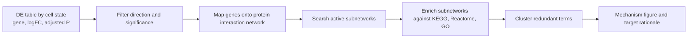

# Analysis Walkthrough

This is the file I would use to rehearse the technical story. It walks through what was done, why it was done, what the code is doing, and what the results mean biologically.

Repo entry points:

- [Primary Seurat analysis](https://github.com/Caffeinated-Code/Ramachandran2019_LiverCirrhosis_MASH_scRNAseq/blob/main/workflow/03_compact_analysis.R)
- [Reference label refinement](https://github.com/Caffeinated-Code/Ramachandran2019_LiverCirrhosis_MASH_scRNAseq/blob/main/workflow/07_refine_annotations.R)
- [Donor-level pseudobulk DE](https://github.com/Caffeinated-Code/Ramachandran2019_LiverCirrhosis_MASH_scRNAseq/blob/main/workflow/08_pseudobulk_de.R)
- [Target prioritization](https://github.com/Caffeinated-Code/Ramachandran2019_LiverCirrhosis_MASH_scRNAseq/blob/main/workflow/04_prioritize_targets.R)
- [Dashboard](https://github.com/Caffeinated-Code/Ramachandran2019_LiverCirrhosis_MASH_scRNAseq/blob/main/dashboard/app.R)
- [Nextflow demo](https://github.com/Caffeinated-Code/Ramachandran2019_LiverCirrhosis_MASH_scRNAseq/tree/main/nextflow/fibrotarget_demo)

## 1. Why UMAP Over t-SNE

UMAP and t-SNE are visualization tools. I do not use either one to prove differential expression or target biology. I use them to inspect whether cells with similar transcriptomes group together and whether disease, donor, fraction, or annotation labels make biological sense.

Why UMAP here:

- UMAP is fast and scales well for tens of thousands of cells.
- UMAP generally preserves local neighborhoods and gives a somewhat more useful view of broader relationships between cell states than default t-SNE.
- UMAP is standard in current Seurat workflows, which makes the analysis easier for another bioinformatician to rerun and inspect.
- UMAP works well for visualizing continuous activation programs, which matters in fibrosis because HSC activation, endothelial remodeling, and macrophage injury states often look like gradients rather than clean boxes.

What I would not say:

- I would not say that distance between far-apart UMAP islands is quantitative truth.
- I would not call a cluster a cell type only because it separates on UMAP.
- I would not use UMAP coordinates for DE.

The analysis uses UMAP after PCA and nearest-neighbor graph construction:

```text
raw count matrix
  -> Seurat object per sample
  -> merge human liver samples
  -> QC filter
  -> log-normalization
  -> variable genes
  -> scaling
  -> PCA
  -> nearest-neighbor graph
  -> clustering
  -> UMAP for visualization
```

Code path: [workflow/03_compact_analysis.R](https://github.com/Caffeinated-Code/Ramachandran2019_LiverCirrhosis_MASH_scRNAseq/blob/main/workflow/03_compact_analysis.R)

Key interpretation:

- UMAP by disease checks whether disease broadly shifts cell states.
- UMAP by compartment checks whether marker-defined HSC/myofibroblast, macrophage/monocyte, and endothelial populations are coherent.
- UMAP by refined labels checks whether reference-informed annotations align with the marker-based calls.

## 2. What The Published Seurat Object Was Used For

The primary reproducible input is the GEO count matrix. That means the pipeline starts from public raw-style matrices, not from a pre-analyzed R object.

The published Ramachandran Seurat object is used only as a reference layer. In plain English:

- The authors already annotated cells in their Seurat object.
- Their object includes fields such as `annotation_lineage` and `annotation_indepth`.
- `annotation_lineage` is a broad lineage label, such as immune, endothelial, mesenchymal, epithelial.
- `annotation_indepth` is a more detailed label, such as scar-associated macrophage or endothelial subtype.
- I used those labels to support cluster interpretation after rebuilding the analysis from the count matrices.

This avoids two problems:

- If I only used the published object, the work would be less reproducible because the analysis would depend on someone else's serialized state.
- If I ignored the published annotations, I would be throwing away useful expert labels from the original study.

The practical workflow is:

```text
GEO count matrices
  -> primary Seurat analysis
  -> clusters and marker scores
  -> compare cluster marker profiles with published annotation labels
  -> assign conservative refined labels
```

Code path: [workflow/07_refine_annotations.R](https://github.com/Caffeinated-Code/Ramachandran2019_LiverCirrhosis_MASH_scRNAseq/blob/main/workflow/07_refine_annotations.R)

The right interview sentence:

> I rebuilt the analysis from GEO matrices for reproducibility, then used the published Seurat annotations as a reference to avoid over- or under-calling known liver fibrosis cell states.

## 3. How Compartments Were Identified

The assignment asked for three disease-relevant compartments:

- HSC, mesenchymal, myofibroblast-like cells
- macrophage and monocyte cells
- endothelial cells

I identified them using marker programs defined in [config/project.yaml](https://github.com/Caffeinated-Code/Ramachandran2019_LiverCirrhosis_MASH_scRNAseq/blob/main/config/project.yaml):

| Compartment | Marker logic | Why it matters |
|---|---|---|
| HSC/myofibroblast-like | COL1A1, COL3A1, ACTA2, TAGLN, PDGFRA, PDGFRB, LUM, DCN, RGS5 | Scar-producing stromal biology |
| Macrophage/monocyte | TREM2, CD9, SPP1, GPNMB, LST1, C1QA, C1QB, C1QC | Injury-associated immune remodeling |
| Endothelial | ACKR1, PLVAP, VWF, PECAM1, KDR, RAMP2, ENG | Scar-associated vascular remodeling |

The code calculates a marker score for each program and assigns the compartment with the highest score if it passes a minimum signal threshold. Cells that do not clearly match are kept as `other_or_unresolved`.

Pitfall avoided:

- I did not force every cell into one of the required compartments.
- I did not call fine stromal subtypes from one marker alone.
- I kept labels conservative because activated HSCs, portal fibroblasts, pericytes, and myofibroblast-like states can share collagen and contractile markers.

Outputs:

- [required_compartment_marker_dotplot.png](https://github.com/Caffeinated-Code/Ramachandran2019_LiverCirrhosis_MASH_scRNAseq/blob/main/reports/figures/required_compartment_marker_dotplot.png)
- [umap_required_compartments.png](https://github.com/Caffeinated-Code/Ramachandran2019_LiverCirrhosis_MASH_scRNAseq/blob/main/reports/figures/umap_required_compartments.png)
- [refined_cluster_annotations.csv](https://github.com/Caffeinated-Code/Ramachandran2019_LiverCirrhosis_MASH_scRNAseq/blob/main/reports/tables/refined_cluster_annotations.csv)

## 4. Fibrosis And Cirrhosis-Associated Genes

### Cell-Level DE

The first DE pass uses Seurat `FindMarkers` within each required compartment:

```text
for each compartment:
  subset cells in compartment
  compare cirrhotic cells vs healthy cells
  Wilcoxon test
  keep exploratory gene table
```

Output: [compartment_de_cell_level_exploratory.csv](https://github.com/Caffeinated-Code/Ramachandran2019_LiverCirrhosis_MASH_scRNAseq/blob/main/reports/tables/compartment_de_cell_level_exploratory.csv)

What it is good for:

- Fast screening.
- Finding obvious compartment programs.
- Generating candidate genes for scoring and pathway analysis.

What it is not good for:

- Final inference.
- Donor-level claims.
- Target nomination by itself.

Why simple cell-level DE is dangerous:

```text
Donor A has 8,000 macrophages
Donor B has 500 macrophages
Donor C has 300 macrophages

Cell-level test sees 8,800 cells.
Biologically, that may be only 3 donors.

If Donor A has a strong idiosyncratic signal, thousands of cells from Donor A can drive a tiny p-value.
The p-value then reflects repeated sampling from one donor more than true population-level disease biology.
```

### Donor-Level Pseudobulk DE

Pseudobulk fixes the independence problem by aggregating raw counts by donor and cell state:

```text
cells
  -> group by refined cell state + donor + disease
  -> sum raw counts per gene
  -> one pseudobulk profile per donor/state
  -> limma model: expression ~ disease
  -> cirrhotic vs healthy at donor level
```

Code path: [workflow/08_pseudobulk_de.R](https://github.com/Caffeinated-Code/Ramachandran2019_LiverCirrhosis_MASH_scRNAseq/blob/main/workflow/08_pseudobulk_de.R)

Why it is better:

- Donor is the biological replicate.
- It reduces false confidence from many cells in one donor.
- It lets us ask whether a candidate is consistent across donors.

Caveats:

- Some refined states have too few donors or cells and are excluded.
- Pseudobulk can lose rare substate signal if the annotation is too broad.
- In a compact take-home setting, limma on logCPM is practical, but for a larger production run I would use edgeR, DESeq2, muscat, or dreamlet depending on the design.

What we learn from pseudobulk:

- COL1A1, COL3A1, TIMP1, and PDGFRA have stronger donor-level support in HSC/myofibroblast-like states.
- ACKR1 has strong endothelial donor-level support.
- Macrophage-state candidates remain biologically important but need a macrophage-focused validation atlas before therapeutic nomination.

Outputs:

- [pseudobulk_de_by_refined_state.csv](https://github.com/Caffeinated-Code/Ramachandran2019_LiverCirrhosis_MASH_scRNAseq/blob/main/reports/tables/pseudobulk_de_by_refined_state.csv)
- [pseudobulk_priority_gene_de.csv](https://github.com/Caffeinated-Code/Ramachandran2019_LiverCirrhosis_MASH_scRNAseq/blob/main/reports/tables/pseudobulk_priority_gene_de.csv)

## 5. Pathway And Mechanism Analysis

The current workflow uses Hallmark gene set enrichment to summarize mechanisms from disease-up genes. This is useful as a compact, auditable first pass.

Code path: [workflow/04_prioritize_targets.R](https://github.com/Caffeinated-Code/Ramachandran2019_LiverCirrhosis_MASH_scRNAseq/blob/main/workflow/04_prioritize_targets.R)

Current output:

- [hallmark_pathway_enrichment.csv](https://github.com/Caffeinated-Code/Ramachandran2019_LiverCirrhosis_MASH_scRNAseq/blob/main/reports/tables/hallmark_pathway_enrichment.csv)

For a richer mechanism module, pathfindR is a good fit because it does active-subnetwork enrichment. Instead of asking only whether a static gene set is over-represented, it searches protein-interaction subnetworks enriched for DE signal, then maps those subnetworks to pathways.

Conceptual pathfindR-style flow:



How I would use it here:

- Run pathfindR separately for HSC/myofibroblast, macrophage, and endothelial pseudobulk signatures.
- Use upregulated cirrhosis genes only for the primary fibrosis mechanism read.
- Compare pathfindR terms against Hallmark results.
- Promote pathways only if they align with donor-level DE and known liver fibrosis biology.

Pitfall avoided:

- Pathway enrichment is not proof of causality. It is a mechanism-prioritization layer.

## 6. Biomarker And Target Prioritization Score

The scoring is rule-based because the dataset is small and the priority is interpretability. This is closer to how a target review meeting works: evidence is weighted, penalties are explicit, and every score can be challenged.

Code path: [workflow/04_prioritize_targets.R](https://github.com/Caffeinated-Code/Ramachandran2019_LiverCirrhosis_MASH_scRNAseq/blob/main/workflow/04_prioritize_targets.R)

Scoring outputs:

- [ranked_biomarker_target_candidates_translational.csv](https://github.com/Caffeinated-Code/Ramachandran2019_LiverCirrhosis_MASH_scRNAseq/blob/main/reports/tables/ranked_biomarker_target_candidates_translational.csv)
- [target_prioritization_scoring_components.csv](https://github.com/Caffeinated-Code/Ramachandran2019_LiverCirrhosis_MASH_scRNAseq/blob/main/reports/tables/target_prioritization_scoring_components.csv)
- [target_prioritization_scoring_method.csv](https://github.com/Caffeinated-Code/Ramachandran2019_LiverCirrhosis_MASH_scRNAseq/blob/main/reports/tables/target_prioritization_scoring_method.csv)

Algorithm:

```text
total_score =
  disease association
+ donor-level pseudobulk support
+ compartment specificity
+ pathway coherence
+ external validation
+ modality and assayability
+ mouse conservation
- safety and tissue-specificity penalties
- blood specificity penalty
- therapeutic risk penalty
```

Important refinement:

- A gene only gets donor-level pseudobulk credit when the signal appears in its intended biological compartment.
- Example: PLVAP should get endothelial credit, not HSC credit. If PLVAP appears in an HSC-like state, I treat that cautiously because it may reflect scar-niche mixing, ambient RNA, doublets, or closely apposed vascular cells.

Candidate categories:

| Category | Meaning | Example use |
|---|---|---|
| Diagnostic biomarker | Helps detect disease state or fibrosis burden | SMOC2, COL1A1, COL3A1, PLVAP |
| Pharmacodynamic biomarker | Tracks response to intervention | TIMP1, CD9, GPNMB |
| Therapeutic target | Plausible intervention point | PDGFRA, PDGFRB |
| Future validation marker | Strong biology but not ready for nomination | TREM2, SPP1, ACKR1 |

Why this is more true to biology than a single DE rank:

- It separates marker strength from therapeutic tractability.
- It penalizes broad or risky biology.
- It rewards conservation and external support.
- It keeps macrophage and vascular candidates in the story without overclaiming them.

## 7. Ranked Candidates And Interpretation

The current top tier is best read by category, not as a single winner-takes-all list.

Near-term biomarker and pharmacodynamic candidates:

- TIMP1: assayable, secreted, strong matrix remodeling signal, but broad injury specificity.
- SMOC2: secreted HSC-linked marker with MASH support, best as biomarker or pharmacodynamic candidate first.
- COL1A1 and COL3A1: strong fibrosis burden markers, not attractive direct targets.
- PLVAP and ACKR1: scar-associated vascular markers, best for tissue-state and spatial validation.

Therapeutic hypotheses:

- PDGFRA and PDGFRB: druggable receptor biology tied to activated stromal states. Main question is therapeutic window because PDGF biology is not liver-specific.
- LOXL2: mechanistically relevant matrix crosslinking biology, but prior anti-LOXL2 clinical experience makes this a cautionary example rather than a lead.

Mechanism and validation queue:

- TREM2, CD9, SPP1, and GPNMB: macrophage-state biology with strong fibrosis relevance. These should move to macrophage atlas, spatial, and perturbation validation before any therapeutic claim.

## 8. Translational Action Plan

Current MASH context matters. Approved and advanced therapies are largely metabolic or systemic disease-modifying approaches, including resmetirom and semaglutide. That means a fibrosis-target discovery program should not try to beat approved metabolic drugs with a weak fibrosis marker. It should find where single-cell biology adds something sharper.

Smart first moves:

1. **Biomarker track first:** SMOC2, TIMP1, COL1A1, COL3A1, PLVAP, ACKR1.
   - Goal: tissue and plasma/serum assay strategy, pharmacodynamic readout, spatial localization.
   - Why first: biomarkers can be validated faster and support patient stratification or response monitoring.

2. **Stromal perturbation track:** PDGFRA and PDGFRB.
   - Goal: HSC/myofibroblast activation assays, collagen output, contraction, proliferation, safety window.
   - Why second: more therapeutic potential, but higher safety burden.

3. **Macrophage mechanism track:** TREM2, SPP1, GPNMB, CD9.
   - Goal: macrophage-focused atlas validation, spatial proximity to scar, ligand-receptor and perturbation assays.
   - Why third: high biology, but macrophage programs can be protective or pathogenic depending on timing.

What not to chase first:

- Direct collagen targeting as a therapeutic program.
- Broad inflammatory targets without cell-state specificity.
- Targets with only cell-level DE and no donor or validation support.

## 9. Next Steps

Most useful next experiments:

- Spatial validation for SMOC2, TIMP1, PLVAP, ACKR1, PDGFRA/B, and macrophage-state markers.
- Full GSE244832 all-gene object reanalysis on AWS.
- Add macrophage atlas validation for TREM2/CD9/SPP1/GPNMB.
- Add pathfindR or ReactomePA active mechanism module.
- Add ligand-receptor module with LIANA/NicheNet/CellChat and require donor, spatial, and receiver-response support.
- Run perturbation evidence review for therapeutic hypotheses before naming a program.

## 10. What Went Beyond The Assignment

Keep this modest:

- Interactive Shiny dashboard.
- Standalone Nextflow demo that runs locally.
- AWS-ready Nextflow pattern using the same demo contract.

## 11. References

- Ramachandran et al. Resolving the fibrotic niche of human liver cirrhosis at single-cell level. Nature, 2019. https://www.nature.com/articles/s41586-019-1631-3
- Ramachandran Seurat object, Edinburgh DataShare. https://datashare.ed.ac.uk/handle/10283/3433
- McInnes et al. UMAP visualization. Nature Biotechnology, 2018. https://www.nature.com/articles/nbt.4314
- Kobak and Berens. The art of using t-SNE for single-cell transcriptomics. Nature Communications, 2019. https://www.nature.com/articles/s41467-019-13056-x
- Single-cell best practices, data integration chapter. https://www.sc-best-practices.org/cellular_structure/integration
- Hoffman et al. dreamlet pseudobulk differential expression for large-scale single-cell data. Nature Communications, 2023. https://pmc.ncbi.nlm.nih.gov/articles/PMC10187426/
- pathfindR active-subnetwork enrichment. https://egeulgen.github.io/pathfindR/
- Andrews et al. scRNA-seq and snRNA-seq comparison in human liver. Hepatology Communications, 2022. https://pmc.ncbi.nlm.nih.gov/articles/PMC8948611/
- FDA Rezdiffra drug trials snapshot. https://www.fda.gov/drugs/drug-approvals-and-databases/drug-trials-snapshots-rezdiffra
- FDA Wegovy MASH approval. https://www.fda.gov/drugs/news-events-human-drugs/fda-approves-treatment-serious-liver-disease-known-mash
- Gilead STELLAR-3 selonsertib update. https://www.gilead.com/news/news-details/2019/gilead-announces-topline-data-from-phase-3-stellar-3-study-of-selonsertib-in-bridging-fibrosis-f3-due-to-nonalcoholic-steatohepatitis-nash
- Roche acquisition of 89bio and pegozafermin context. https://www.roche.com/media/releases/med-cor-2025-09-18
- Avsec et al. Enformer. Nature Methods, 2021. https://www.nature.com/articles/s41592-021-01252-x
- Ji et al. DNABERT. Bioinformatics, 2021. https://academic.oup.com/bioinformatics/article/37/15/2112/6128680
