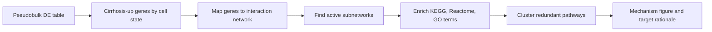

# Analysis Walkthrough

This walkthrough explains the analysis methods, why each choice was made, what the results mean, and where the interpretation stays cautious. It is written to be readable by a computational biologist, a translational scientist, or a wet-lab collaborator reviewing the work.

## 1. Analysis Design

The primary question is:

> Which cell-state-linked genes in human liver fibrosis are plausible biomarkers, pharmacodynamic readouts, therapeutic hypotheses, or validation priorities?

The workflow starts from GEO count matrices rather than a precomputed object. That makes the analysis reproducible and keeps the published Seurat object in the right role: annotation support, not the source of truth.

Main code paths:

- [workflow/02_curate_metadata.R](../workflow/02_curate_metadata.R): sample manifest and inclusion/exclusion logic
- [workflow/03_compact_analysis.R](../workflow/03_compact_analysis.R): Seurat preprocessing, clustering, UMAP, marker scoring, exploratory DE
- [workflow/07_refine_annotations.R](../workflow/07_refine_annotations.R): reference-informed label refinement
- [workflow/08_pseudobulk_de.R](../workflow/08_pseudobulk_de.R): donor-level pseudobulk DE
- [workflow/04_prioritize_targets.R](../workflow/04_prioritize_targets.R): pathway enrichment and target scoring
- [workflow/13_validate_blood_mouse_markers.R](../workflow/13_validate_blood_mouse_markers.R): blood specificity and mouse conservation checks

The analysis keeps one rule throughout: discovery evidence, validation evidence, and translational evidence are separate layers. A candidate becomes more credible when those layers agree.

## 2. Dataset And Metadata Curation

Primary dataset: **GSE136103**, human cirrhotic and healthy liver scRNA-seq from Ramachandran et al.

The GEO archive contains human liver, human blood, and mouse liver libraries. The primary contrast uses only human liver tissue:

```text
healthy human liver
  vs
cirrhotic human liver
```

Blood and mouse samples are not mixed into that contrast because they answer different questions. Blood can test whether candidates are broad circulating signals. Mouse can test whether orthologs move in the expected direction for preclinical follow-up. Mixing them into the primary model would confound disease with tissue and species.

Output:

- [data/metadata/gse136103_sample_manifest.csv](../data/metadata/gse136103_sample_manifest.csv)

Interpretation:

- The primary analysis is a clean human liver disease comparison.
- The secondary blood and mouse modules increase translational confidence without weakening the primary contrast.

## 3. QC And Preprocessing

Seurat is used for local analysis because it is widely used, installed in the local environment, and appropriate for a compact R-based single-cell workflow.

Workflow:

```text
GEO matrix per library
  -> Seurat object per library
  -> merge primary human liver libraries
  -> JoinLayers for Seurat v5 compatibility
  -> QC filter
  -> NormalizeData
  -> FindVariableFeatures
  -> ScaleData
  -> RunPCA
  -> FindNeighbors
  -> FindClusters
  -> RunUMAP
```

The compact workflow uses:

- minimum detected genes: 200
- mitochondrial cutoff: 25 percent
- variable genes: 3,000
- PCA dimensions used for graph and UMAP: 1:20
- clustering resolution: 0.5

Why these choices are conservative:

- Fibrotic liver contains stressed and injured cells. A very strict mitochondrial cutoff can remove real disease biology.
- The 200-gene minimum removes obvious low-complexity droplets without trying to over-optimize every sample.
- QC is summarized by library and compartment so the filter can be audited.

Outputs:

- [reports/tables/qc_by_library.csv](../reports/tables/qc_by_library.csv)
- [reports/tables/qc_filtered_by_library_compartment.csv](../reports/tables/qc_filtered_by_library_compartment.csv)

Caution:

- This compact workflow does not claim full production-grade doublet or ambient RNA correction. A production run should add scDblFinder/DoubletFinder and SoupX/CellBender/DecontX, then verify that activated stromal, macrophage, and endothelial disease states are not removed.

## 4. Why UMAP Instead Of t-SNE

UMAP and t-SNE are both visualization methods. Neither is used for statistical inference.

UMAP is used here because:

- it is fast for tens of thousands of cells
- it is standard in Seurat workflows
- it preserves local neighborhoods well enough for cell-state inspection
- it usually gives a more useful view of broader activation continua than default t-SNE

This matters in fibrosis because disease biology is often gradual:

```text
quiescent stromal cell
  -> activated HSC-like state
  -> collagen-rich myofibroblast-like state
```

UMAP helps inspect those transitions. It does not prove that two far-apart clusters are biologically distant, and it is not used for differential expression.

Outputs:

- [reports/figures/umap_disease_state.png](../reports/figures/umap_disease_state.png)
- [reports/figures/umap_required_compartments.png](../reports/figures/umap_required_compartments.png)
- [reports/figures/umap_refined_cell_states.png](../reports/figures/umap_refined_cell_states.png)

Interpretation:

- UMAP by disease checks whether disease states occupy distinct parts of transcriptomic space.
- UMAP by compartment checks whether marker-supported populations are coherent.
- UMAP by refined label checks whether reference-informed labels align with marker evidence.

## 5. Published Seurat Object As Annotation Reference

The published Ramachandran Seurat object contains expert annotations from the original study. The workflow uses it as a reference layer, not as the primary data source.

The distinction matters:

| Role | Input | Why |
|---|---|---|
| Primary analysis | GEO count matrices | reproducible from public input |
| Annotation support | published Seurat metadata | leverages expert labels without inheriting the full serialized analysis |

The reference object includes metadata fields such as:

- `annotation_lineage`: broad lineage label
- `annotation_indepth`: more detailed annotation

The workflow compares rebuilt clusters against those labels and writes refined cluster annotations.

Output:

- [reports/tables/refined_cluster_annotations.csv](../reports/tables/refined_cluster_annotations.csv)

Interpretation:

- The reference helps prevent under-calling known fibrotic niche populations.
- The count matrices remain the reproducible input, so the work is not just a reuse of an RData object.

## 6. Compartment Identification

The requested disease-relevant compartments were identified using marker programs defined in [config/project.yaml](../config/project.yaml).

| Compartment | Markers | Biological purpose |
|---|---|---|
| HSC/mesenchymal/myofibroblast-like | COL1A1, COL3A1, ACTA2, TAGLN, PDGFRA, PDGFRB, LUM, DCN, RGS5 | scar-producing stromal program |
| Macrophage/monocyte | TREM2, CD9, SPP1, GPNMB, LST1, C1QA, C1QB, C1QC | injury-associated immune remodeling |
| Endothelial | ACKR1, PLVAP, VWF, PECAM1, KDR, RAMP2, ENG | scar-associated vascular remodeling |

The code calculates marker scores and assigns a broad compartment if one program is clearly highest and above threshold. Cells without enough evidence remain `other_or_unresolved`.

Why this is appropriate:

- The assignment required these broad compartments.
- Marker programs are transparent and auditable.
- Conservative labels avoid pretending that compact analysis can fully resolve activated HSCs, portal fibroblasts, pericytes, and myofibroblast states.

Key output:

- [reports/figures/required_compartment_marker_dotplot.png](../reports/figures/required_compartment_marker_dotplot.png)

Caution:

- Activated stromal subtypes overlap. COL1A1, COL3A1, ACTA2, TAGLN, PDGFRB, LUM, and DCN support a fibrogenic stromal state, but finer subtype labels need deeper subclustering, spatial context, and protein validation.

## 7. Differential Expression

Two DE layers are kept because they serve different purposes.

### Cell-Level DE

Cell-level DE is run with Seurat `FindMarkers` inside each broad compartment:

```text
subset compartment
  -> cirrhotic cells vs healthy cells
  -> Wilcoxon test
  -> exploratory marker table
```

Output:

- [reports/tables/compartment_de_cell_level_exploratory.csv](../reports/tables/compartment_de_cell_level_exploratory.csv)

Purpose:

- fast screening
- obvious marker discovery
- input to early pathway and candidate scoring

Pitfall:

```text
one donor with 8,000 macrophages
another donor with 500 macrophages
another donor with 300 macrophages

cell-level DE sees 8,800 cells
biology sees 3 donors
```

If one donor has a strong idiosyncratic signal, thousands of cells from that donor can dominate the p-value. That is why cell-level DE is not the final evidence layer.

### Donor-Level Pseudobulk DE

Pseudobulk aggregates raw counts by donor and refined cell state:

```text
cells from one donor and one cell state
  -> sum raw counts per gene
  -> one donor-level profile
  -> limma model: expression ~ disease
```

Output:

- [reports/tables/pseudobulk_de_by_refined_state.csv](../reports/tables/pseudobulk_de_by_refined_state.csv)
- [reports/tables/pseudobulk_priority_gene_de.csv](../reports/tables/pseudobulk_priority_gene_de.csv)

What it teaches:

- COL1A1, COL3A1, TIMP1, and PDGFRA gain donor-level support in HSC/myofibroblast-like states.
- ACKR1 has strong endothelial support.
- Macrophage candidates remain biologically important but need a macrophage-focused external atlas before target nomination.

Caveats:

- Rare cell states may be excluded if too few donors or cells are available.
- Broad annotations can dilute substate-specific signal.
- A larger production run should consider edgeR, DESeq2, muscat, or dreamlet depending on design and covariates.

## 8. Pathway And Mechanism Analysis

The current workflow uses Hallmark enrichment on compartment-specific cirrhosis-up genes. This keeps the mechanism layer interpretable.

Output:

- [reports/tables/hallmark_pathway_enrichment.csv](../reports/tables/hallmark_pathway_enrichment.csv)

Interpretation:

- Stromal states show matrix remodeling and EMT-like programs.
- Endothelial states show vascular remodeling, junction, and coagulation-linked programs.
- Macrophage states show injury, repair, lipid-handling, and metabolic programs.

Pathway enrichment is not proof of causality. It summarizes the biology that should guide validation.

### pathfindR Extension

For a production mechanism module, pathfindR fits this analysis well because it searches active subnetworks in protein interaction space before pathway enrichment.



How to use it:

- run separately for stromal, macrophage, and endothelial pseudobulk signatures
- compare against Hallmark results
- keep pathways only when they align with donor-level DE and known liver fibrosis biology

## 9. Biomarker And Target Prioritization

The scoring model is rule-based because the donor count is small and interpretability matters. The goal is not to rank genes by p-value. The goal is to decide which genes are useful, assayable, conserved, and safe enough to move forward.

Code:

- [workflow/04_prioritize_targets.R](../workflow/04_prioritize_targets.R)

Outputs:

- [reports/tables/ranked_biomarker_target_candidates_translational.csv](../reports/tables/ranked_biomarker_target_candidates_translational.csv)
- [reports/tables/target_prioritization_scoring_components.csv](../reports/tables/target_prioritization_scoring_components.csv)
- [reports/tables/target_prioritization_scoring_method.csv](../reports/tables/target_prioritization_scoring_method.csv)

Scoring logic:

```text
total score =
  disease association
+ donor-level pseudobulk support
+ compartment specificity
+ pathway coherence
+ external validation
+ modality and assayability
+ mouse conservation
- safety and tissue-specificity risk
- blood specificity penalty
- therapeutic risk penalty
```

Important guardrail:

- Donor-level pseudobulk credit is awarded only when the signal appears in the candidate's intended compartment.
- For example, PLVAP should be supported by endothelial signal. HSC-like PLVAP signal is treated cautiously because it may reflect scar-niche proximity, ambient RNA, doublets, or mixed clusters.

Candidate categories:

| Category | Meaning | Examples |
|---|---|---|
| Diagnostic biomarker | helps detect disease state or fibrosis burden | SMOC2, COL1A1, COL3A1, PLVAP |
| Pharmacodynamic biomarker | tracks response to intervention | TIMP1, CD9, GPNMB |
| Therapeutic target | plausible intervention point | PDGFRA, PDGFRB |
| Future validation marker | strong biology, not ready for nomination | TREM2, SPP1, ACKR1 |

The dashboard includes dropdowns for candidate class and clinical use case.

## 10. Validation

### GSE244832

Role: MASH/MASLD HSC and myofibroblast validation.

Why it adds value:

- human liver
- MASH-relevant labels
- strong HSC activation focus

Output:

- [reports/tables/gse244832_focused_object_candidate_summary.csv](../reports/tables/gse244832_focused_object_candidate_summary.csv)
- [reports/figures/gse244832_focused_object_validation_heatmap.png](../reports/figures/gse244832_focused_object_validation_heatmap.png)

Interpretation:

- SMOC2, TIMP1, PDGFRA, and PDGFRB show useful HSC-like validation signal.
- COL1A1 and COL3A1 remain strong burden markers.

### GSE207310

Role: bulk liver NAFLD/NASH directionality.

Why it adds value:

- human biopsy RNA-seq
- phenotype metadata
- independent support for candidate directionality

Output:

- [reports/tables/validation_gse207310_candidate_lm_results.csv](../reports/tables/validation_gse207310_candidate_lm_results.csv)

Caution:

- Bulk RNA-seq supports directionality but cannot identify cell of origin.

### Blood And Mouse From GSE136103

Role:

- blood: circulating marker specificity
- mouse: ortholog conservation and preclinical directionality

Outputs:

- [reports/tables/gse136103_blood_candidate_marker_role_summary.csv](../reports/tables/gse136103_blood_candidate_marker_role_summary.csv)
- [reports/tables/gse136103_mouse_candidate_ortholog_summary.csv](../reports/tables/gse136103_mouse_candidate_ortholog_summary.csv)

Interpretation:

- TIMP1 and LST1 are detectable in blood, so they need context-aware interpretation.
- Most stromal, endothelial, and collagen candidates are low or absent in blood, supporting liver-niche specificity.
- Fibrotic mouse liver shows strongest directionality for macrophage-state orthologs such as Trem2, Spp1, Gpnmb, Cd9, and complement genes.
- Mouse stromal support is weaker in the two-sample screen and should be expanded in a larger preclinical dataset.

## 11. Translational Interpretation

The current MASH treatment landscape changes how the target list should be used. Approved therapies such as resmetirom and semaglutide address metabolic disease biology and histologic improvement in noncirrhotic MASH with moderate-to-advanced fibrosis. A single-cell fibrosis workflow should add value by identifying cell-state biomarkers, pharmacodynamic readouts, and more precise stromal or immune hypotheses.

Priority action plan:

| Track | Candidates | First experiment |
|---|---|---|
| Biomarker and pharmacodynamic | SMOC2, TIMP1, COL1A1, COL3A1, PLVAP, ACKR1 | tissue localization, serum/plasma assay feasibility, longitudinal response |
| Stromal perturbation | PDGFRA, PDGFRB | HSC spheroids, co-culture, precision-cut liver slices |
| Macrophage mechanism | TREM2, CD9, SPP1, GPNMB | macrophage atlas validation, spatial proximity, ligand-receptor analysis |

Clinical and industry context:

- Resmetirom approval shows the value of liver-directed metabolic mechanisms in F2-F3 MASH.
- Semaglutide approval shows the importance of systemic metabolic benefit plus histologic endpoints.
- Selonsertib and simtuzumab failures show why fibrosis targets need strong mechanism, patient selection, and response biomarkers.
- FGF21 programs such as pegozafermin and efruxifermin show continued interest in metabolic-fibrotic biology and compensated cirrhosis.

Where Enformer or DNABERT-like models fit:

- They are useful if the question is regulatory: variants, enhancers, promoter effects, or cell-type-specific gene regulation.
- They do not prove that perturbing SMOC2, PDGFRA, or TREM2 will reverse fibrosis.
- In this project they would be an optional evidence column for regulatory plausibility, not a replacement for transcriptomics, protein localization, and perturbation assays.

## 12. Next Steps

Most useful follow-up work:

1. Spatial validation for SMOC2, TIMP1, PLVAP, ACKR1, PDGFRA/B, and macrophage-state markers.
2. Full GSE244832 all-gene object reanalysis on AWS.
3. Macrophage-focused atlas validation for TREM2, CD9, SPP1, and GPNMB.
4. pathfindR or ReactomePA active mechanism module.
5. LIANA, NicheNet, or CellChat communication module with donor and receiver-response filters.
6. Perturbation experiments before therapeutic nomination.

## References

- Ramachandran et al. Resolving the fibrotic niche of human liver cirrhosis at single-cell level. Nature, 2019. https://www.nature.com/articles/s41586-019-1631-3
- Ramachandran Seurat object, Edinburgh DataShare. https://datashare.ed.ac.uk/handle/10283/3433
- McInnes et al. UMAP visualization. Nature Biotechnology, 2018. https://www.nature.com/articles/nbt.4314
- Kobak and Berens. The art of using t-SNE for single-cell transcriptomics. Nature Communications, 2019. https://www.nature.com/articles/s41467-019-13056-x
- Single-cell best practices, data integration chapter. https://www.sc-best-practices.org/cellular_structure/integration
- Hoffman et al. dreamlet pseudobulk differential expression. Nature Communications, 2023. https://pmc.ncbi.nlm.nih.gov/articles/PMC10187426/
- pathfindR active-subnetwork enrichment. https://egeulgen.github.io/pathfindR/
- Andrews et al. scRNA-seq and snRNA-seq comparison in human liver. Hepatology Communications, 2022. https://pmc.ncbi.nlm.nih.gov/articles/PMC8948611/
- FDA Rezdiffra approval package. https://www.accessdata.fda.gov/drugsatfda_docs/nda/2024/217785Orig1s000Approv.pdf
- FDA Wegovy MASH approval. https://www.fda.gov/drugs/news-events-human-drugs/fda-approves-treatment-serious-liver-disease-known-mash
- Gilead STELLAR-3 selonsertib update. https://www.gilead.com/news/news-details/2019/gilead-announces-topline-data-from-phase-3-stellar-3-study-of-selonsertib-in-bridging-fibrosis-f3-due-to-nonalcoholic-steatohepatitis-nash
- Roche acquisition of 89bio and pegozafermin context. https://www.roche.com/media/releases/med-cor-2025-09-18
- Avsec et al. Enformer. Nature Methods, 2021. https://www.nature.com/articles/s41592-021-01252-x
- Ji et al. DNABERT. Bioinformatics, 2021. https://academic.oup.com/bioinformatics/article/37/15/2112/6128680
