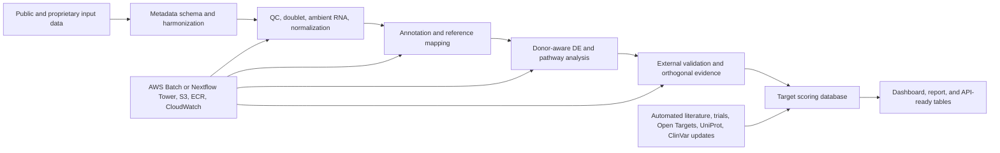

# Written Responses

The approach is to nominate targets only when the signal is coherent, assayable, conserved, and realistic to validate. 

## 01. Dataset Curation And Fibrosis-Stage Harmonization

**Original question:** You are given five publicly available human liver scRNA-seq/snRNA-seq datasets from different studies. Each dataset uses different fibrosis labels: some use METAVIR F0-F4, some use cirrhosis/non-cirrhosis, some use NASH/MASH categories, and some have incomplete clinical metadata. How would you curate, harmonize, and validate these datasets before downstream biomarker discovery?

I would start with a sample-level manifest before doing any integration. Each donor gets fields for dataset accession, donor ID, assay type, single-cell versus single-nucleus, tissue source, disease label, fibrosis system, original fibrosis label, harmonized fibrosis bin, etiology, biopsy type, chemistry, sex, age, BMI, diabetes status, and medication history if available.

I would keep scRNA-seq and snRNA-seq as explicit labels. They are not interchangeable. scRNA-seq can overrepresent dissociation-resistant or viable cells and has stronger mitochondrial/ribosomal signatures. snRNA-seq captures frozen tissue and nuclear transcripts better, but can change apparent hepatocyte and stromal signal. A harmonized atlas can include both, but the assay label must remain available for QC, integration, and sensitivity analysis.

I would preserve the original fibrosis labels and add harmonized labels rather than overwriting them:

| Original label type | Keep as | Harmonized analysis label |
|---|---|---|
| METAVIR or similar F0-F4 | `fibrosis_stage_original` | F0-F1, F2-F3, F4 |
| cirrhosis/non-cirrhosis | `clinical_label_original` | non-cirrhotic, cirrhotic |
| MASL/MASH or NAFL/NASH | `disease_activity_original` | metabolic liver disease activity |
| missing stage | `fibrosis_stage_missing_reason` | unknown, excluded from stage-specific DE |

I would then create a unified label with three layers:

| Layer | Example values | Why it matters |
|---|---|---|
| Original clinical label | F0, F1, F2, F3, F4, cirrhosis, NASH | preserves what the study actually reported |
| Harmonized fibrosis bin | no or mild fibrosis, significant fibrosis, cirrhosis | enables cross-study modeling |
| Evidence confidence | high, moderate, uncertain | prevents weak labels from driving biomarker discovery |

F1-F4 remains valuable because fibrosis is clinically staged and therapeutic development often focuses on F2-F3 or compensated F4. I would not collapse everything into disease versus control unless the dataset forces that. F2+ is especially important because it usually represents clinically meaningful fibrosis and is the population targeted by many MASH trials.

Major multi-dataset liver and single-cell studies generally do three things: keep source labels, add harmonized labels, and validate the harmonization biologically. For example, liver scRNA/snRNA comparisons show assay-specific capture differences, and integration studies use labels such as donor, assay, and batch to avoid confusing technology with disease. I would follow that logic.

How I would validate the harmonized labels before biomarker discovery:

```text
clinical metadata
  -> preserve original label
  -> map to harmonized label
  -> assign confidence
  -> test sample-level biology
  -> run sensitivity analysis
```

Concrete validation steps:

| Check | Method | What I expect in advanced fibrosis |
|---|---|---|
| Sample-level clustering | pseudobulk PCA or UMAP using donor-level expression | F3/F4 and cirrhosis samples should trend toward scar programs, not random donor-only separation |
| Marker biology | module scores by donor and compartment | collagen matrix, activated HSC/myofibroblast, macrophage injury, endothelial remodeling |
| Histology agreement | biopsy report or microscopic review when available | bridging fibrosis, nodularity, ductular reaction, inflammatory activity |
| Classifier sanity check | random forest or elastic net on donor-level modules | useful only if cross-study validation works and feature importance is biologically coherent |
| Sensitivity analysis | rerun DE with uncertain labels removed | top biology should not collapse when low-confidence samples are excluded |

Pseudobulk PCA is especially useful here. I would aggregate expression by donor and broad cell type, score fibrosis modules, then ask whether samples labeled as advanced fibrosis occupy a consistent region of the sample-level space. This does not prove the label is correct, but it quickly finds mismatches, such as an F4 sample with no stromal activation or a control sample with a strong scar program.

A classifier can help as a validation tool, not as the source of truth. I would train it on high-confidence samples, use donor-level features, and test on held-out studies. If the model predicts fibrosis stage from COL1A1, COL3A1, TIMP1, PDGFRB, ACKR1, PLVAP, TREM2, and macrophage/endothelial modules, that is biologically plausible. If it predicts stage from dataset ID, chemistry, mitochondrial percentage, or one donor-specific artifact, the harmonization has failed.

If microscopic or pathology review is available, I would use it to adjudicate discordant samples. The best harmonized label is not just a renamed clinical field. It is a documented label supported by original metadata, fibrosis nomenclature, sample-level transcriptomic biology, and pathology context where available.

## 02. QC And Preprocessing For Liver scRNA-seq/snRNA-seq

**Original question:** For human liver fibrosis scRNA-seq and snRNA-seq datasets, what QC steps would you apply, and how would you avoid removing biologically meaningful stressed or diseased cells while still removing poor-quality cells, doublets, ambient RNA, and batch artifacts?

Liver disease samples are fragile, fatty, fibrotic, and inflammatory. Aggressive QC can remove exactly the stressed hepatocytes, activated stromal cells, and injury-associated macrophages we want to study.

I would calculate the same core metrics for every dataset, then interpret thresholds by assay, tissue quality, cell type, and disease state.

| Metric | Why it is checked | Typical starting action |
|---|---|---|
| detected genes | low values mark empty droplets or poor capture | start around 200 genes for scRNA-seq, then inspect per sample |
| UMI counts | extreme high values can mark doublets | flag sample-specific high tails rather than using one global cutoff |
| mitochondrial percentage | damaged cells often have high mitochondrial reads | review around 15-25 percent in scRNA-seq; be conservative in diseased liver |
| ribosomal percentage | stress, dissociation, or library bias | review by sample and cell type, usually not a hard filter alone |
| hemoglobin genes | blood/RBC ambient RNA or contamination | flag high hemoglobin libraries or droplets |
| dissociation stress genes | tissue processing artifact | annotate or regress cautiously, not automatic removal |
| ambient RNA | soup from lysed cells or abundant hepatocyte transcripts | use SoupX, CellBender, or DecontX when needed |
| doublet score | two cells captured together | use scDblFinder, DoubletFinder, Scrublet, or Solo and confirm with marker logic |
| sample yield | failed prep or biased capture | inspect cells per donor, fraction, and disease group |
| assay type | scRNA-seq versus snRNA-seq differs biologically and technically | keep as metadata and use in sensitivity analysis |

For scRNA-seq, I would start with a low-gene filter around 200 genes, review mitochondrial percentage around 15-25 percent, and remove extreme high-gene or high-UMI cells only after checking whether they are true doublets. For snRNA-seq, mitochondrial percentage is less informative, intronic/nuclear signal matters more, and thresholds can be lower or shifted by chemistry. 

Primary dataset example:

In this repo, the compact Seurat workflow uses `min.features = 200` and a default mitochondrial cutoff of 25 percent. That is intentionally conservative. The goal is to remove obvious failures while avoiding deletion of diseased cells that carry stress biology. The result is tracked in:

- `reports/tables/qc_by_library.csv`
- `reports/tables/qc_filtered_by_library_compartment.csv`
- `workflow/03_compact_analysis.R`

How I avoid over-filtering:

```text
apply initial QC
  -> check cell-state recovery
  -> check disease marker retention
  -> check donor/sample balance
  -> adjust only if a filter removes biology or keeps obvious artifacts
```

Doublets and ambient RNA:

- Use tools such as DoubletFinder, scDblFinder, Scrublet, or Solo depending on framework.
- Use SoupX, CellBender, or DecontX when ambient RNA is visible.
- Do not remove every cell with mixed markers automatically in fibrotic tissue. Scar niches can contain doublets, but they can also contain tightly apposed vascular, stromal, and immune cells. I would inspect UMI burden, doublet score, and marker co-expression before removing them.

The important principle is to separate filtering from annotation. Annotation labels cells that are biologically unusual while Filtering removes cells that are technically unreliable. Diseased, stressed, or activated cells belong in the analysis unless there is clear evidence they are technical artifacts.

## 03. Integration Without Erasing Fibrosis Biology

**Original question:** How would you integrate multiple liver fibrosis single-cell datasets while making sure batch correction does not remove real fibrosis-stage biology?

I would first analyze each dataset separately. If a fibrosis program is not visible before integration, integration will not drastically make it trustworthy.

Then I would integrate for annotation and visualization, not for final DE. I would keep raw counts for pseudobulk DE and use integrated embeddings to align comparable cell types.

How I would protect disease signal:

- Keep original counts for DE.
- Integrate in a reduced space for annotation.
- Do not regress out fibrosis stage.
- Include assay type and donor where appropriate.
- Compare marker and pathway signals before and after integration.
- Test whether known fibrosis programs survive: COL1A1/COL3A1 stromal signal, TREM2/CD9 macrophage states, PLVAP/ACKR1 endothelial remodeling.
- Run sensitivity analysis per dataset and per assay type.

Method choice depends on the study design:

| Method | Best use | Watch-out |
|---|---|---|
| Seurat CCA | datasets with shared cell types and moderate batch effects | can over-align when disease and dataset are confounded |
| Seurat RPCA | conservative integration of similar datasets | often a good first choice when preserving biology matters |
| Harmony | fast reduced-space correction across many donors or batches | tune carefully and do not correct on fibrosis stage |
| scVI | large datasets, complex covariates, probabilistic latent space | needs Python stack and careful validation that disease signal remains |
| scANVI | semi-supervised mapping when some labels are trusted | label errors can propagate if the reference is weak |
| FastMNN | overlapping cell populations across batches | less reliable when cell-type composition differs strongly |
| LIGER | shared and dataset-specific factor modeling | interpretation can be harder; validate factors biologically |

My default for this liver fibrosis project would be Seurat RPCA or Harmony for a transparent first pass, then scVI or scANVI if the dataset becomes large enough to benefit from a model-based latent space. I would compare at least two methods on a subset and choose the one that aligns known cell types without flattening known fibrosis biology.

Normalization issues:

- LogNormalize is transparent and works for compact Seurat analysis.
- SCTransform can be useful, but if sequencing depth correlates with disease or cell type, it needs careful review.
- For mixed scRNA-seq/snRNA-seq atlases, assay-aware normalization and sensitivity analysis are essential.
- For DE, I would use raw counts aggregated to donor-level pseudobulk, not corrected expression from the integrated embedding.

The final rule:

> Integration should help align equivalent cell types and not make F4 liver look healthy.

## 04. Cell-Type Annotation And Validation In Fibrotic Liver

**Original question:** Suppose automated annotation labels a cluster as fibroblast, but the cluster expresses COL1A1, COL3A1, ACTA2, TAGLN, PDGFRB, LUM, DCN, and is strongly enriched in F3/F4 samples. How would you validate whether this represents activated hepatic stellate cells, portal fibroblasts, myofibroblasts, or a mixed stromal state?

I would not accept the automated label as final. That marker set says the cluster is fibrogenic and activated, but it does not prove a pure fibroblast subtype.

I would treat this as partly a classification problem and partly a regression or continuum problem. Classification answers which stromal subtype the cells are closest to. Regression asks where each cell sits along HSC identity, portal-fibroblast identity, pericyte or mural identity, and myofibroblast activation axes. Fibrotic stromal biology often behaves more like a gradient than clean bins.

I would break the question into layers:

```text
Is it stromal?
  COL1A1, COL3A1, LUM, DCN

Is it activated / myofibroblast-like?
  ACTA2, TAGLN, TIMP1, contractile and matrix-remodeling genes

Is it HSC-like?
  PDGFRB, RGS5, LRAT, RBP1, vitamin A or retinoid-associated programs

Is it portal fibroblast-like?
  THY1, ELN, PI16, COL15A1, portal matrix programs

Is it pericyte or vascular mural-like?
  RGS5, MCAM, CSPG4, NOTCH3

Is it mixed or transitional?
  multiple programs, broad donor distribution, possible doublet or spatial niche signal
```

I would score each axis rather than force one label too early:

```text
HSC identity score
portal fibroblast score
pericyte or mural score
myofibroblast activation score
cell-cycle and stress score
doublet score
donor reproducibility
```

Then I would place the cells on a stromal subclustering or trajectory map. If a cluster sits between quiescent HSC-like cells and ACTA2/TAGLN-high myofibroblast-like cells, a graded activation label is more accurate than a hard subtype label.

I would also check whether the cluster appears across several F3/F4 donors. A cluster driven by one donor may be real, but it is weaker for biomarker discovery.

Validation tools:

- marker dot plots and heatmaps
- donor and disease composition
- reference mapping to published liver atlases
- trajectory or activation score within stromal cells
- spatial transcriptomics or RNAscope/IHC if available
- protein validation for PDGFRB, ACTA2, COL1A1, THY1, or other candidate markers

My label would be conservative unless evidence is strong:

> activated mesenchymal or HSC/myofibroblast-like state

This label honestly tells the biology without over reaching that the compact analysis can cleanly separate HSCs, portal fibroblasts, pericytes, and myofibroblasts.

## 05. Donor-Aware Differential Expression And Biomarker Discovery

**Original question:** You want to find genes associated with F2+ fibrosis in macrophages and endothelial cells. Why is simple cell-level differential expression dangerous here, and what statistical strategy would you use instead?

F2+ matters because it is clinically meaningful fibrosis. It is often the point where patients move from early disease into a risk group relevant for drug development, trial enrichment, and longitudinal monitoring. F2-F3 is also the noncirrhotic fibrosis range targeted by approved and late-stage MASH therapies.

Simple cell-level DE is dangerous because cells are not independent patients.

Example:

```text
F2+ macrophages:
  Donor 1: 9,000 cells
  Donor 2: 600 cells
  Donor 3: 400 cells

F0-F1 macrophages:
  Donor 4: 700 cells
  Donor 5: 500 cells
  Donor 6: 450 cells
```

A cell-level test behaves as if it has thousands of replicates. But biologically, it has six donors. If Donor 1 has a strong inflammatory program, the p-value can become extremely small because the same donor is counted thousands of times.

Better strategy:

```text
macrophage cells
  -> aggregate raw counts by donor and fibrosis bin
  -> one pseudobulk profile per donor
  -> model expression ~ F2+ status + covariates
  -> test genes at donor level
```

I would use edgeR, DESeq2, or limma-voom depending on dataset size and design. For multiple studies, dreamlet is attractive because it supports pseudobulk modeling with random effects and large-scale single-cell data.

Cell-level DE still has a role. It is useful for screening and marker discovery but should not be the final basis for target nomination.

## 06. AI/ML-Based Biomarker Prioritization

**Original question:** After differential expression and pathway analysis, you have 300 candidate fibrosis-associated genes across hepatic stellate cells, macrophages, endothelial cells, and cholangiocytes. How would you use machine learning or AI to prioritize a short list of biomarkers and therapeutic targets?

I would start with a transparent scoring model, then add ML only when the data can support it.

For a small donor dataset, a rule-based score is stronger and intuitive than an ML black-box model. The score should include:

- donor-level disease association
- cell-type specificity
- pathway coherence
- external validation
- protein modality
- assayability
- mouse conservation
- blood/tissue specificity
- safety penalties
- clinical and perturbation evidence

If enough datasets are available, I would test supervised models on donor-level features:

- random forest or elastic net for F0-F1 versus F2-F4 classification
- ordinal models for F0-F4 when labels are reliable
- survival or progression models if longitudinal outcomes exist
- cross-study validation, never only random cell-level splits

Random forest can be useful for nonlinear marker panels, but I would train it on donor-level pseudobulk or sample-level module scores, not individual cells. Otherwise the model learns donor identity and cell-capture artifacts.

How AI could help:

- summarize literature and trial evidence
- retrieve perturbation evidence
- generate candidate rationales
- score regulatory plausibility using Enformer or DNABERT-style models when the hypothesis is about gene regulation or variant effects

Where AI should not be overused:

- Enformer and DNABERT do not tell us that perturbing a gene will reverse fibrosis in HSCs.
- Sequence models may add a regulatory-evidence column if we have relevant enhancers, ATAC peaks, variants, or promoter hypotheses.
- They are not substitutes for donor-aware transcriptomics, protein localization, and perturbation assays.

My final shortlist would come from the intersection of statistics, biology, modality, validation, safety, and current players in this domain and not from one model score.

## 07. Cell-Cell Interaction And Pathway Mechanism Discovery

**Original question:** This project wants to understand fibrosis progression mechanisms, including scar-associated macrophages, activated stellate cells, and endothelial remodeling. How would you analyze cell-cell communication, and how would you prevent overinterpreting ligand-receptor predictions?

I would use ligand-receptor tools as hypothesis generators, then require evidence that the receiver cell actually changes. Good tools include LIANA, CellChat, CellPhoneDB, NicheNet, NATMI, and Connectome. LIANA is useful for comparing multiple ligand-receptor methods in one framework. CellChat is useful for pathway-level communication summaries. NicheNet is useful when the question is whether ligands from sender cells explain target-gene changes in receiver cells.

Sequential plan:

```text
Define states
  -> scar macrophage, activated HSC, endothelial remodeling states
Run ligand-receptor inference
  -> require ligand in sender and receptor in receiver
Add receiver evidence
  -> target genes, pathway activity, pseudobulk support
Add context
  -> disease enrichment, donor consistency, spatial proximity
Prioritize experiments
  -> perturbable ligand, receptor, or downstream pathway
```

High-value liver fibrosis hypotheses:

- scar-associated macrophage to activated HSC signaling
- endothelial remodeling and immune-cell recruitment
- cholangiocyte or injured hepatocyte signals that activate stromal cells
- matrix-remodeling feedback between stromal cells and macrophages

Bioinformatic filters I would apply:

| Filter | Why it matters |
|---|---|
| donor-level support | prevents one donor or one cluster from driving the interaction |
| cell-state specificity | removes generic housekeeping or pan-inflammatory signals |
| receiver response | requires target genes or pathway activation in the receiving cell |
| pathfindR or pathway support | asks whether receiver DE genes form connected active subnetworks, not just isolated marker changes |
| spatial plausibility | ligand and receptor cells should be near each other when spatial data exist |
| disease directionality | interaction should increase with fibrosis stage or disease activity |
| perturbability | ligand, receptor, or pathway should be experimentally testable |

I would use pathfindR after donor-aware pseudobulk DE, especially on receiver-cell signatures. For example, if macrophage ligands are predicted to activate HSCs, the receiver-side HSC pseudobulk DE should show connected Reactome or KEGG modules such as extracellular matrix organization, collagen formation, integrin signaling, TGF-beta-linked matrix remodeling, or PDGF-related activation. That does not prove the ligand caused the module, but it makes the hypothesis much more testable than a ligand-receptor edge alone.

The workflow is:

```text
ligand-receptor prediction
  -> receiver pseudobulk DE
  -> pathfindR active-subnetwork enrichment
  -> spatial proximity if available
  -> perturb ligand or receptor in a controlled system
```

How I avoid overinterpretation:

- Ligand and receptor mRNA do not prove protein expression.
- Expression does not prove physical contact.
- Physical proximity does not prove signaling.
- A predicted interaction does not prove fibrosis causality.
- Many ligand-receptor databases are incomplete or biased toward well-studied immune pathways.

Wet-lab validation turns the prediction into a mechanism. I would test priority pairs in macrophage-HSC or endothelial-HSC co-culture, liver organoids, precision-cut liver slices, or mouse fibrosis models. A strong experiment would knock down or block the ligand in the sender cell, or the receptor in the receiver cell, then measure HSC activation, collagen production, TIMP1/SMOC2 expression, contractility, macrophage state, and endothelial activation. If blocking a predicted macrophage ligand reduces ACTA2, COL1A1, COL3A1, or TIMP1 in HSCs, the interaction becomes much more credible.


## 08. Reproducible Pipeline And Delivery Plan

**Original question:** If you were asked to deliver this project end-to-end in 12-16 weeks, what would your reproducible analysis pipeline look like? Describe the repository structure, tools, milestones, quality checks, and final deliverables.

I would deliver it as a reproducible, parameterized workflow with one local command, a cloud execution path, and a living current evidence layer that can keep the target-prioritization database real-time.

Repository structure:

```text
config/        dataset paths, marker panels, thresholds, scoring weights
workflow/      ordered R analysis modules
scripts/       data prep, validation, evidence enrichment
src/           shared helper functions
nextflow/      local and AWS workflow execution
dashboard/     Shiny app and dashboard-ready data
reports/       HTML summary, tables, figures, written responses
docs/          analysis walkthrough and technical appendix
data/demo/     tiny tracked demo dataset
```

Production view:



One-command local run:

```bash
make all
```

Nextflow demo:

```bash
make nextflow-demo
```

Direct Nextflow local run:

```bash
export PATH="/opt/homebrew/opt/openjdk/bin:$PATH"
nextflow run nextflow/fibrotarget_demo -profile local --outdir reports/nextflow_demo
```

AWS pattern:

```bash
export NXF_WORK=s3://<bucket>/fibrotarget-liver/work
export PIPELINE_IMAGE=<account>.dkr.ecr.us-west-2.amazonaws.com/fibrotarget-liver:latest

nextflow run nextflow/fibrotarget_demo -profile aws \
  --input s3://<bucket>/demo/demo_samplesheet.csv \
  --outdir s3://<bucket>/results/fibrotarget-demo
```

Why AWS is a good production choice for this type of bioinformatics:

- S3 gives durable storage for raw data, processed matrices, reports, and audit logs.
- AWS Batch can scale Nextflow jobs across many datasets without tying up a local workstation.
- ECR keeps the exact analysis container versioned.
- CloudWatch gives centralized logs for debugging and audit.
- Step Functions or EventBridge can schedule evidence refresh jobs.
- IAM, KMS, and VPC controls help when proprietary or clinical metadata are involved.
- Parallel execution makes it easier to add orthogonal evidence, such as bulk RNA-seq, spatial data, proteomics, CRISPR screens, pathology features, or real-world clinical data.

Milestones:

1. Weeks 1-2: dataset inventory, metadata harmonization, pipeline skeleton.
2. Weeks 3-4: QC, preprocessing, doublet and ambient RNA handling.
3. Weeks 5-6: annotation, reference mapping, marker validation.
4. Weeks 7-8: donor-aware DE and pathway analysis.
5. Weeks 9-10: external validation across MASH, fibrosis, and macrophage datasets.
6. Weeks 11-12: target scoring, druggability, conservation, safety triage.
7. Weeks 13-14: dashboard, report, and internal review.
8. Weeks 15-16: final documentation, reproducibility check, handoff.

Quality checks:

- schema validation for metadata
- expected output checks
- no raw data or private files in Git
- toy dataset CI run
- container and `renv` lockfile
- reproducible HTML report
- dashboard smoke test
- Nextflow local demo results tracked

Living evidence layer:

| Source | What it contributes | Refresh cadence |
|---|---|---|
| GEO, SRA, Single Cell Portal, CELLxGENE | new liver single-cell, bulk, and spatial datasets | monthly |
| PubMed and bioRxiv/medRxiv | new fibrosis biology and perturbation papers | weekly or monthly |
| ClinicalTrials.gov | active, failed, and completed MASH/fibrosis programs | weekly |
| Open Targets, UniProt, ClinVar, OMIM | tractability, safety, protein, variant evidence | monthly |
| DrugBank or ChEMBL where licensed/available | modality and compound evidence | monthly |
| internal proprietary datasets | validation, patient segmentation, assay context | project-specific |

The evidence database should not automatically nominate targets. It should update evidence fields, flag changes, and make target-review meetings faster and more defensible.

Final deliverables:

- reproducible GitHub repo
- Docker and `renv`
- Nextflow local/AWS demo
- executive HTML report
- ranked candidate table
- validation tables and figures
- Shiny dashboard
- methods walkthrough
- next-experiment plan

## References

- Ramachandran et al. Resolving the fibrotic niche of human liver cirrhosis at single-cell level. Nature, 2019. https://www.nature.com/articles/s41586-019-1631-3
- Ramachandran Seurat object, Edinburgh DataShare. https://datashare.ed.ac.uk/handle/10283/3433
- Andrews et al. Single-cell, single-nucleus, and spatial RNA sequencing of human liver. https://pmc.ncbi.nlm.nih.gov/articles/PMC8948611/
- Single-cell best practices, data integration. https://www.sc-best-practices.org/cellular_structure/integration
- Tran et al. Benchmark of batch-effect correction methods for single-cell RNA-seq data. https://genomebiology.biomedcentral.com/articles/10.1186/s13059-019-1850-9
- Semi-supervised integration of single-cell transcriptomics data. https://www.nature.com/articles/s41467-024-45240-z
- Hoffman et al. dreamlet pseudobulk differential expression. https://pmc.ncbi.nlm.nih.gov/articles/PMC10187426/
- pathfindR active-subnetwork enrichment. https://egeulgen.github.io/pathfindR/
- CellChat v2 protocol. https://www.nature.com/articles/s41596-024-01045-4
- NicheNet best-practices workflow. https://arxiv.org/abs/2404.16358
- LIANA cell-cell communication framework. https://github.com/saezlab/liana
- FDA Rezdiffra snapshot. https://www.fda.gov/drugs/drug-approvals-and-databases/drug-trials-snapshots-rezdiffra
- FDA Wegovy MASH approval. https://www.fda.gov/drugs/news-events-human-drugs/fda-approves-treatment-serious-liver-disease-known-mash
- Avsec et al. Enformer. https://www.nature.com/articles/s41592-021-01252-x
- Ji et al. DNABERT. https://academic.oup.com/bioinformatics/article/37/15/2112/6128680
